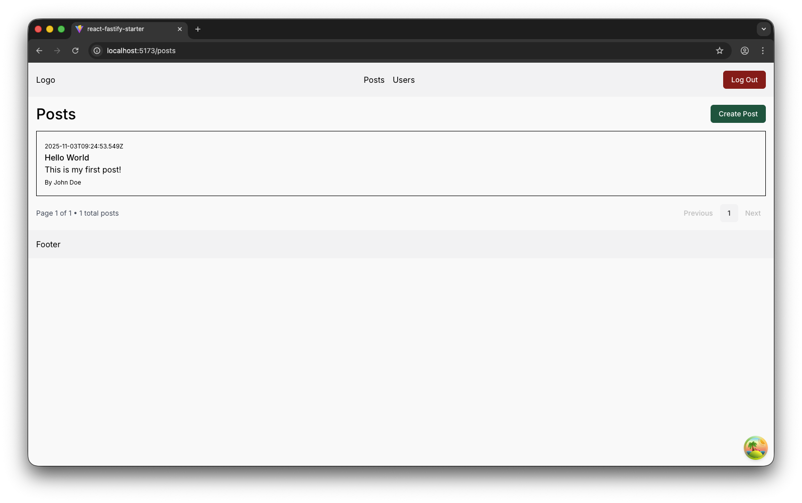

# ✨ React Fastify Starter

A starter full-stack docker monorepo template for CRUD dashboards and web apps — with a type-safe, backend (Fastify, TypeScript, PostgreSQL, Prisma), a simple frontend (React, Vite, Tailwind CSS), and OpenAPI-powered type sharing.

---

## 1. 🌐 Project Overview

**React Fastify Starter** is designed for developers who want a scalable, maintainable full-stack web apps. It features:

- End-to-end type safety
- JWT authentication with role-based access ("admin", "editor", "viewer")
- Modern React frontend with Vite
- PostgreSQL database with Prisma ORM
- Dockerized local development
- OpenAPI-driven codegen for shared types to ensure end-to-end type safety

---

## 2. ⚒️ Tech Stack

**Backend:**

- **Fastify** (TypeScript): Fast, low-overhead Node.js web framework
- **PostgreSQL**: Reliable, open-source SQL database
- **Prisma ORM**: Type-safe database client
- **Swagger (OpenAPI)**: API docs and codegen

**Frontend:**

- **React**: Component-based UI
- **Vite**: Lightning-fast build tool
- **React Query**: Data fetching and caching
- **React Router**: Client-side routing
- **Tailwind CSS**: Utility-first styling
- **Cloudflare Workers**: (Optional) Edge deployment

**Authentication:**

- **JWT**: Token stored in HTTP-only cookies

**Tooling:**

- **Docker**: Containerized development
- **npm workspaces**: Monorepo management

---

## 3. 📁 Project Structure

```bash
├── client/           # React + Vite frontend
├── server/           # Fastify backend (TypeScript)
├── packages/
│   └── types/        # Shared TypeScript types (auto-generated)
└── package.json      # Root with npm workspaces
```

- **client/**: All frontend code, including routes, components, hooks, and styles.
- **server/**: Backend Fastify app, API routes, authentication, Prisma models, and Swagger setup.
- **packages/types/**: Auto-generated TypeScript types from the backend OpenAPI spec, used by both client and server for type safety.
- **package.json**: Monorepo root, manages workspaces and scripts.

---

## 4. ⚡ Getting Started

### Prerequisites

- Node.js (v18+ recommended)
- npm (v8+)
- Docker (for local DB and backend)
- PostgreSQL (if not using Docker)

### Environment Setup

1. **Clone the repo:**

```bash
git clone https://github.com/johchai/react-fastify-starter.git
cd react-fastify-starter
```

2. **Install Dependencies**

This installs dependencies for all workspaces (client, server, shared types).
From the project root, run:

```bash
npm install
```

3. **Run Project**

This installs dependencies, copies the server .env, and starts the Docker containers for the backend and database.

```bash
# Which environment do you want to run? (prod/dev) - `dev`
./server-build.sh
```

- Fastify server at [http://localhost:4000](http://localhost:4000)
- Swagger UI (only in dev mode) at [http://localhost:4000/docs](http://localhost:4000/docs)

4. **Start the Frontend**

```bash
cd client
cp .env.example .env
npm run dev
```

- Runs Vite dev server at [http://localhost:5173](http://localhost:5173)

## 5. 📣 API Reference

### Auth Endpoints

- `POST /api/auth/login` — User login (returns JWT)
- `POST /api/auth/register` — User registration
- `POST /api/auth/refresh` — Refresh access token
- `GET /api/auth/me` — Get current user info
- `POST /api/auth/logout` — Logout

### Users & Posts Endpoints

- `GET/POST/PUT/DELETE /api/users` — User management (admin only)
- `GET/POST/PUT/DELETE /api/posts` — Posts CRUD

---

## 6. ✏️ Shared Types & OpenAPI

- The backend generates an OpenAPI spec using Fastify Swagger.
- TypeScript types are generated from the OpenAPI spec and placed in `packages/types`.
- Both client and server import these types for end-to-end type safety.
- Any route changes in the backend should be followed by regenerating the types.

**Regenerate types after API changes:**

```bash
# regenerate TypeScript types - server has to be built first and running in dev mode
npm run build:type
```

---

## 7. 📖 Production Deployment

### Build the Frontend

- Outputs static assets for deployment (e.g., to Cloudflare Workers, Vercel, Netlify)

```bash
cd client
npm run build
# OR npm run deploy if using Cloudflare Workers
```

### Build the Backend

```bash
# Which environment do you want to run? (prod/dev) - `prod`
# Make sure the .env's variables are set with external DB connection (e.g. supabase).
./server-build.sh
```
